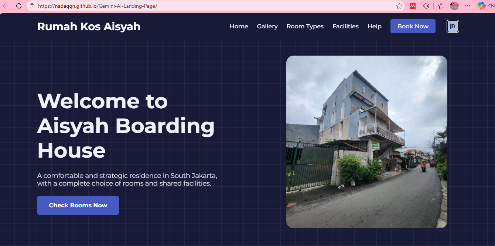
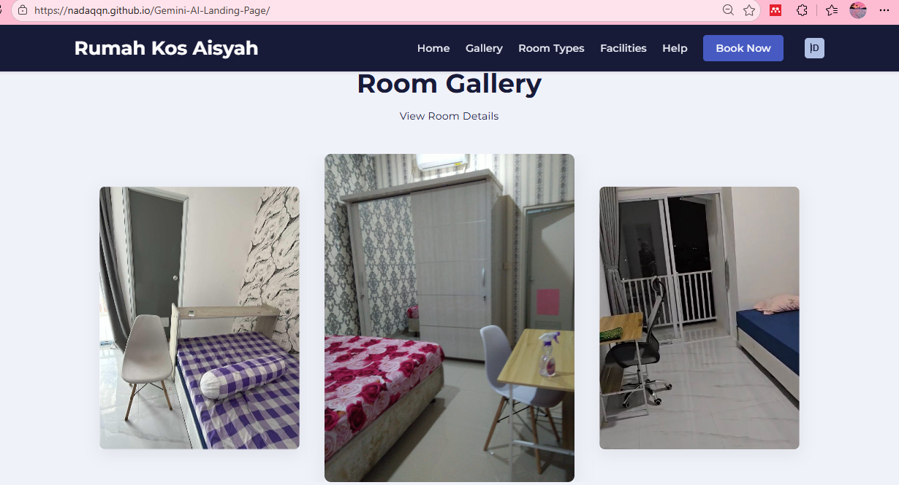
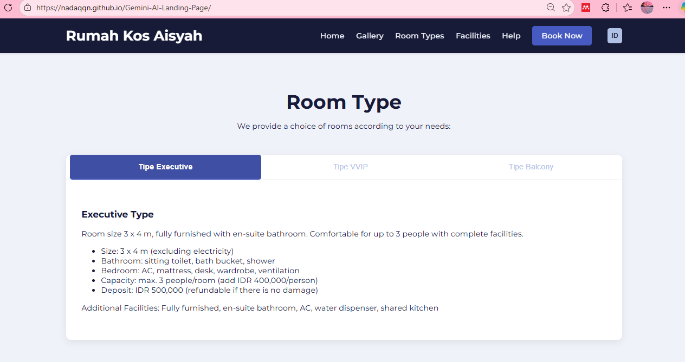
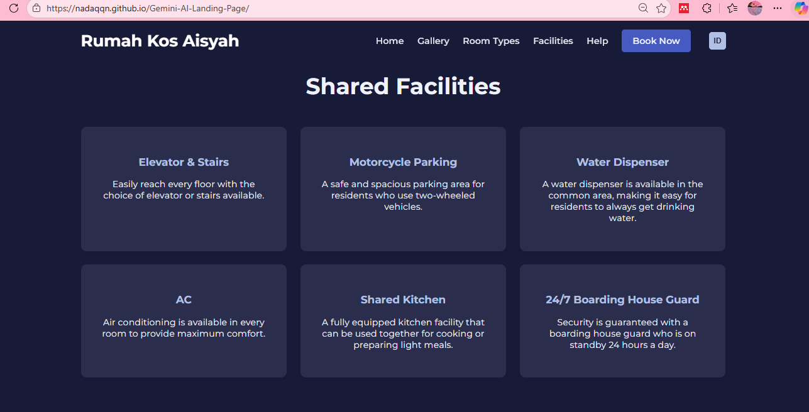
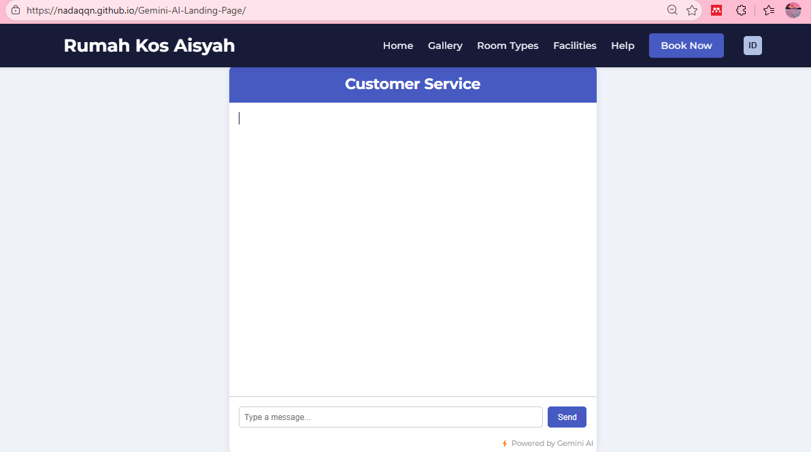

# 🏠 Aisyah Boarding House - AI Landing Page

An AI-powered landing page designed to enhance customer experience for a boarding house through multilingual support and intelligent chatbot interaction.

## 🚀 Live Demo

[(Live Demo)](https://nadaqqn.github.io/Gemini-AI-Landing-Page/)

## ✨ Features

* 🌐 Multi-language toggle (Indonesian / English)
* 🏠 Hero section with strong CTA
* 🖼️ Responsive gallery slider
* 🗂️ Room types with tab-based detail layout
* 📦 Card-based shared facilities section
* 🤖 Gemini AI Service Chat:

  * FAQ automation
  * Room availability inquiries
  * Direct contact to manager

## 🛠️ Tech Stack

* HTML
* CSS
* Tailwind CSS
* JavaScript
* Gemini AI API (Google AI)

## 📸 Preview
### Home Page

### Home Page

### Room Types Page

### Facilities Page

### Help Page

## 💡 Concept

This project demonstrates how AI can be integrated into a landing page to automate customer service and improve user engagement in property rental businesses.

## 📈 Future Improvements

* Booking system integration
* WhatsApp API integration
* Admin dashboard
* AI personalization based on user behavior

## 👩‍💻 Author

Made with ❤️ by Nadaqqn
